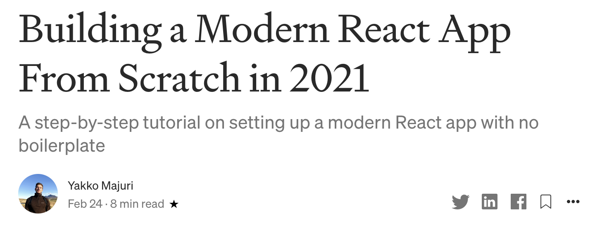

<h1 align='center' style='margin: auto; text-align: center'>
    Convert all your Medium posts into a Gatsby blog in 5 min
</h1>    


## [Demo](https://www.youtube.com/watch?v=3hk558XEbUs)

## How to use

Run the commands below substituting `MEDIUM_URL` and `MEDIUM_USERNAME` for the values applicable to you.

```shell
git clone https://github.com/yakkomajuri/medium-to-blog
cd medium-to-blog
export MEDIUM_URL=https://yakkomajuri.medium.com MEDIUM_USERNAME=yakkomajuri 
yarn start # or npm start
```

And that's it! You'll get a shiny new Gatsby blog with all your Medium posts in it.

## Disclaimer

This is a tool that went from idea to its current state _entirely in one Sunday afternoon_. 

I don't really have time to work on it so I hope it works for you if you encounter this repo :D

It has no tests, and I didn't even re-read the code. By the time I was done it was time for dinner.

## Story

Last weekend I found myself wanting to start a personal blog in order to post more pieces of the "stream of consciousness" style, which wouldn't really fit on my Medium.

However, as someone who's been writing for years, I didn't necessarily want to start fresh, I wanted to bring my existing posts along with me - so I started to think about how to go about this. 

The simplest option would be to link to the Medium posts from the blog, but that didn't feel right.

Another option would be to copy-paste the content and manually structure it in Markdown format (which is what I want my blog to use). That'd be fine, if not for the fact that I have 40 public articles on Medium, all containing pictures, which would make this a long and tedious process.

And thus, I landed on option 3: trying to automate as much of this process as possible, even if it took me longer than it would have if I just did it all in a mostly manual way.

However, there was one caveat. I decided to do this at 2PM on a Sunday afternoon, and I wanted to be done before dinner. I knew I'd have no time to even look at this in the coming week.

So, here's how far I got.

### Deciding what to do

My first idea was to build a tool to get Medium articles into Markdown. If I could do that, I'd be over halfway there regarding my blog.

I briefly contemplated building my own "Medium HTML" -> Markdown tool, but then I found [Turndown](https://github.com/domchristie/turndown) to do a good job at converting the HTML from my Medium articles into Markdown, so I decided I didn't need to reinvent the wheel there. 

There were a few caveats, like Medium only using `pre` HTML tags for code blocks, and Turndown expecting a `code` tag inside of `pre` to actually create a code block. I forked Turndown with the intention of making that and other changes but decided to postpone that for later - it already covered most of what I needed. 

I also tried out [Medium to Markdown](https://chrome.google.com/webstore/detail/convert-medium-posts-to-m/aelnflnmpbjgipamcogpdoppjbebnjea) but that didn't work for me so I just quickly moved away from it. 

At this point, if I went into a Medium article and used 'inspect element' to copy all the HTML inside the one `article` tag Medium has on article pages and used the [online Turndown tool](https://domchristie.github.io/turndown/) to convert it to Markdown, I'd already get a pretty good result. Stopping here would have already saved me a lot of time when compared to the copy-paste method.

However, the afternoon was still young, and, since a lot of the work so far had been done for me already, I became a bit more ambitious. And that was when I decided to see if I could get to a point where, by just passing a Medium username to a script, I could generate a whole blog from it. 

### What are blogs made of?

With a clearer idea now in mind, there were three steps to it:

1. Programmatically getting all my Medium articles
2. Converting the articles to Markdown
3. Generating a blog from them

I started from the bottom (pun unintended) because I felt like that'd be the quickest thing to do.

So I popped open the [Gatsby Starter Templates]() page and chose the most popular theme. 

I then looked at how the template structures its blog posts (where they're located, what the frontmatter looks like, etc) and got a good picture of what to do with my generated Markdown files:

- Create a directory for each post inside `content/blog`
- Inside each directory add the post Markdown file
- Add a frontmatter to each post containing `date` (in ISO format), `description`, and `title`

So that seemed like all I needed to do for this step for now.

### Give me my articles!

With step 3 being pretty much sorted, and step 2 relying quite a bit on an existing tool (Turndown), I moved to step 1.

I started searching for a way to get a list of my posts from Medium, and that led me to dead ends only. 

First, I learned that to use the Medium API [I'd have to email someone for access](https://github.com/Medium/medium-api-docs#21-self-issued-access-tokens), and that even then I probably wouldn't be able to fetch posts from it.

Then I ran into a few people claiming to have the solution, with a lot of them saying using the RSS feed was the way to go. I checked [my RSS feed](https://medium.com/feed/@yakkomajuri) and only found a few of my latest posts, so I'm not sure if Medium used to give a full list here or not, but, either way, it wasn't enough.

I was looking for either a way to get a list of URLs of all my posts, or their raw content. Copy-pasting those URLs was not an option.

I went into my profile page and started inspecting network requests for clues. The only thing that seemed relevant was a request to a `_graphql` endpoint, with a **massive** query. 

I don't have too much experience with GraphQL so I began thinking if I would find it easier to instead just crawl the page programmatically clicking 'Load More' until all my articles are loaded and then grab their links from their respective `a` tags.

However, before that thought ever became anything more than that I had already downloaded the [GraphQL developer tools](https://chrome.google.com/webstore/detail/graphql-developer-tools/hflnkihcpgldmkepajmpooacmmhglpff) extension and was inspecting the query, which I now realized was [almost 2000 lines long](https://gist.github.com/yakkomajuri/d0c89a65b8469af978790518db7d98c3). Phew.

I copied the query into an API testing tool and began to play around and inspect its results. Very quickly everything made sense to me, which I guess is an attestation to the power of GraphQL. 

Without much time I managed to narrow down the query significantly to pull only the data I wanted (the whole point of GraphQL), and I had gotten down to less than 50 lines when I shifted my focus to the parameters.

These were `id`, `username`, `homepagePostsLimit`, `homepagePostsFrom`, and `includeDistributedResponses`.

They seem pretty straightforward, but there were a few questions I still needed to answer, such as:

#### How can I get the `id` programmatically?

I knew each Medium username also has an associated unique ID, and I remembered stumbling upon this when viewing the RSS feed. Sure enough, I accessed the feed, and there is a URL with a query param `source` that contains my author ID. 

There might be an easier way to get this, but I didn't event check, this was already what I needed. I double checked that I could find the ID for other usernames using this method (i.e. that it will always be in the same format) and moved on.

#### What's the limit for `homepagePostsLimit`?

It'd be great if the API just gave me back all my posts at once. So I called it with this value set to 300 and got back a response that the limit was 25. Ok, so I'll need to handle pagination. This was pretty simple though with the API returning a `next` object that could be used for this.

#### What's a distributed response in `includeDistributedResponses`?

I found out this relates to responses to other posts, and I don't need those, so I set it to `false`.

### The Query

After playing around for a bit, I then settled for the following query, which I figured would be everything I needed (turns out it was even a bit more than what I _truly_ needed):

```js
query ProfilePubHandlerQuery($id: ID, $username: ID, $homepagePostsLimit: PaginationLimit, $homepagePostsFrom: String, $includeDistributedResponses: Boolean) {
    userResult(id: $id, username: $username) {
      ... on User {
        id
        name
        username
        bio
        ...ProfilePubScreen_user
      }
    }
  }
  
  fragment ProfilePubScreen_user on User {
    id
    ...PublisherHomepagePosts_publisher
  }
  
  fragment PublisherHomepagePosts_publisher on Publisher {
    id
    homepagePostsConnection(paging: {limit: $homepagePostsLimit, from: $homepagePostsFrom}, includeDistributedResponses: $includeDistributedResponses) {
      posts {
        ...PublisherHomepagePosts_post
      }
      pagingInfo {
        next {
          ...PublisherHomepagePosts_pagingInfo
        }
      }
    }
  }
  
  fragment PublisherHomepagePosts_post on Post {
      ...TruncatedPostCard_post
  }
  
  fragment PublisherHomepagePosts_pagingInfo on PageParams {
    from
    limit
  }
  
  fragment TruncatedPostCard_post on Post {
    mediumUrl
    firstPublishedAt
    title
    previewContent {
        subtitle
    }
}
```

### Putting it all together

With all the steps seemingly in place, I started writing a script to pull it all together.

I started this step off a bit ambitious, thinking I'd write everything in TypeScript, make it a globally-installable package that could be run with `npx` and all that jazz.

But, I held myself back and decided to go as lean as possible.

So to start off I wrote a JS script to do the following, using harcoded values for my own username and domain (now that medium supports custom subdomains for users, each user can have a different domain, so I need to handle that):

1. Get the RSS feed, convert it to JSON, and pull the user ID
2. Call the GraphQL endpoint with the query from above until I had gotten all my posts
3. Get the raw HTML for each article URL 
4. Use Turndown to convert the HTML into Markdown, using only the HTML inside the `article` tags
5. Add a frontmatter to the Markdown output and dump all output files in a dir

This was almost it - I just ran into a few problems:

- I got some extra stuff in the Markdown that I didn't need, such as the title and subtitle, and the Markdown equivalent of my profile card, with the a link to follow me, etc.



- Images didn't seem to be working. Well, I got both `img` tags and Markdown image syntax (``), with the Markdown syntax producing some tiny images, and the `img` tags being seemingly useless.

Here, in a more robust implementation, I would have thrown in a [Beautiful Soup](https://www.crummy.com/software/BeautifulSoup/bs4/doc/) equivalent to clean the HTML before converting it to Markdown, but I was in no mood to read the Docs of whatever the JS equivalent of Beautiful Soup is, so I went the Regex route - yay :D

I spent a bit of time pulling some of my beards hairs out and ended up with 4 regexes to clean up the useless stuff both at the HTML stage as well as at the Markdown stage.

For the images problem, I spent a bit of time testing the URLs inside the `img` tags and didn't get anywhere. Looking to get this done quickly, I just had a regex get rid of 'em and focused on how I could make the little image bigger. 

One option, which would also be more future-proof, would be to actually download these images, rather than just use the Medium-hosted ones. However, I played around with the image URL for a bit and realized I could specify a width in the path, which was generally set to a pretty low number. I decided this was enough. I used a regex for this too and switched whatever the default was to 600px. 

The image was pretty low-res and I believe it is used as some sort of thumbnail (I didn't actually check), but that would do. 

### 0 to 100

With the script now doing what it needed to do, I just needed a way to join it all up into one command.

So I decided to use env vars for configuration and went with this:

```shell
yarn && gatsby new blog https://github.com/gatsbyjs/gatsby-starter-blog && node index.js && cd blog && gatsby develop
```

If it isn't inherently obvious, this:

1. Installs the dependencies
2. Creates a new Gatsby blog
3. Runs the script to get the Medium articles and output the formatted Markdown to the right place inside the blog dir
4. Enters the blog dir
5. Starts the local server

I later added npm support as well with `yarn || npm install`. It's not often that you'll have a `package.json` script install dependencies but I just wanted this to be a one command thing. 

<hr />

And so this is it! That's how I built a blog generator from Medium posts in an afternoon - hopefully it's useful to someone.

It's definitely rough, and there's things that need improvement, like images, code blocks, embeds (e.g. gists), etc. Feel free to update this to suit your needs, as I don't believe I'll be spending much time on it going forward.


